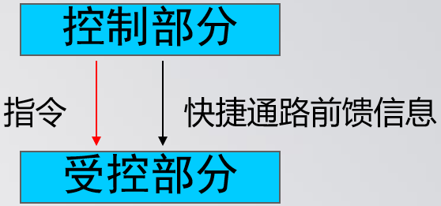

# 序论

## 人体生理学的任务：

研究人体功能及其规律

---

## 机体的内环境：

**内环境：**体内各种组织细胞直接生存的环境

**体液：**细胞内液（2/3）、细胞外液（1/3，≈内环境）

---

## 生命活动的基本特征：

**新陈代谢**：物质代谢（合成代谢、分解代谢）和能量代谢（能量转换利用）；**兴奋性**；**适应性**；**生殖**

---

## 生理功能的调节：

**自身调节：**

凭借自身内在特性，不依赖神经、体液调节，对内环境产生特定适应性反应的过程。如肾小球入球小动脉，通过血管平滑肌的自身调节，改变血管大小，使血流量保持相对稳定。特点：调节强度较弱，影响范围小，灵敏度低。

**体液调节：**

远距分泌：经血液运输至全身

旁分泌：分泌的物质直接进入组织液，经扩散作用到达邻近的细胞

自分泌：分泌的物质在局部扩散，又反馈作用于产生该技术或化学物质的细胞本身

神经内分泌：激素随神经轴突的轴质流至末梢，由末梢释放入血

**神经调节：**

迅速、精确

---

## 控制系统：

**反馈控制系统：**

正反馈：分娩，排尿，血液凝固，动作电位去极化期的Na^+^内流

负反馈：减压反射，血糖浓度调节，肺牵张反射，体温调节

**前馈控制系统：**

前馈控制是指控制部分向受控部分发出指令的同时，又通过另一快捷通路向受控部分发出前馈信息，及时地调控受控部分的活动。

更富预见性，更具有适应意义