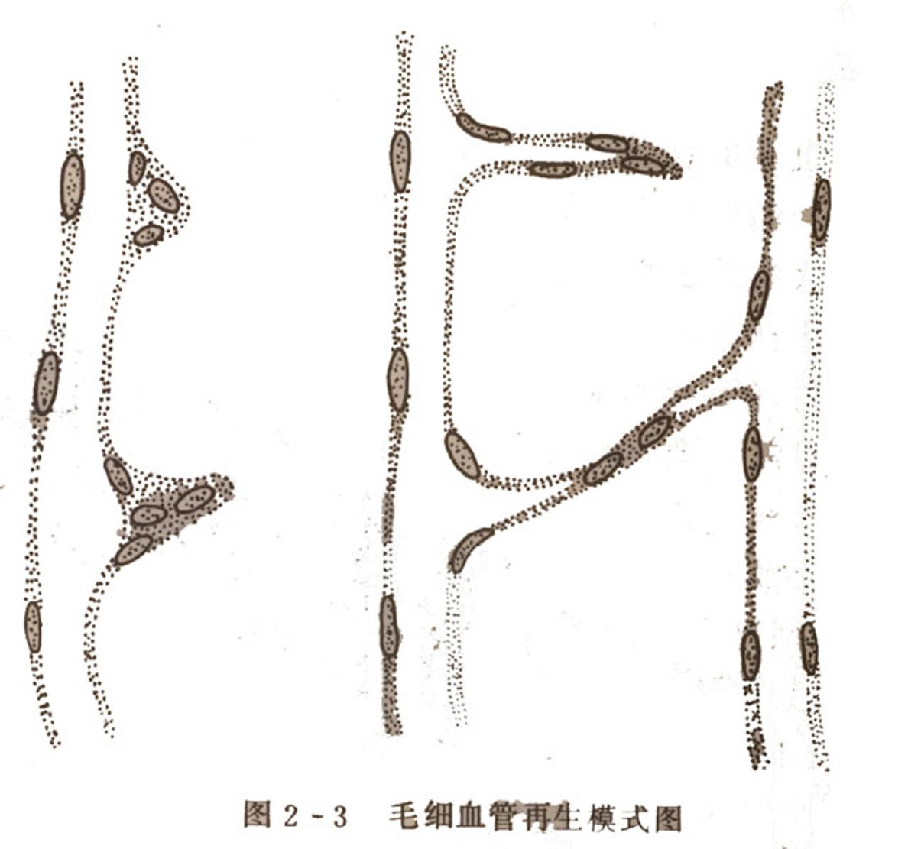

# 损伤的修复

修复：损伤造成机体部分细胞和组织丧失后，机体所形成缺损进行修补恢复的过程

形式分类：再生（由同种细胞修复，完全恢复功能和结构称完全再生）、纤维性修复（由纤维结缔组织修复，也叫瘢痕修复）

---

## 再生：

生理性再生：生理过程中，有些细胞、组织不断老化、消耗，由新生的同种细胞不断补充，始终保持着原有的结构和功能，如表皮、子宫内膜、消化道粘膜上皮细胞

病理性再生：病理状态下细胞、组织缺损后发生的再生

### 细胞的再生潜能：

**不稳定细胞（持续分裂细胞）：**表皮、间皮细胞；消化道、呼吸道、生殖管腔的黏膜上皮细胞；淋巴及造血细胞

**稳定细胞（静止细胞）：**腺或腺样器官实质细胞（肝、胰、涎腺、内分泌腺，汗腺、皮脂腺、肾小管上皮）；间叶组织（纤维、骨、软骨、平滑肌、间叶细胞、神经纤维）

**永久性细胞（非分裂细胞）：**中枢神经细胞、周围神经的神经节细胞、心肌细胞、骨骼肌细胞

### 各种组织再生过程：

**血管再生：**

1. 毛细血管再生：多以生芽方式再生 。首先基底膜分解，该处内皮细胞分裂增生形成突起的幼芽，随着内皮细胞向前移动及后续细胞的增生而形成一条细胞索，数小时后便可出现管腔

    

2. 大血管再生：需手术吻合，内膜结构可恢复。肌层由结缔组织增生连接，形成瘢痕修复

**神经组织的再生：** 

**脑及脊髓内的**神经细胞破坏后不能再生，由神经胶质细胞及其纤维修补，形成胶质瘢痕；**外周神经受损时**，如果与其相连的神经细胞仍然存活，则可完全再生。 

周围神经纤维的再生：断处神经纤维髓鞘和轴突崩解并被吸收，神经鞘细胞增生连接断端，轴突生长，鞘细胞产生髓磷脂包绕轴突形成髓鞘

---

## 纤维性修复：

### 肉芽组织：

概念：由**新生薄壁的毛细血管**以及**增生的成纤维细胞**构成，并伴有**炎细胞**浸润，肉眼表现为鲜红色、颗粒状，柔软湿润，形似鲜嫩的肉芽

成分与形态：毛细血管向创面垂直生长；炎细胞中以巨噬细胞为主，也有数量不等的嗜中性粒细胞及淋巴细胞

**作用：**抗感染，保护创面；填补创口及其他组织缺损；机化或包裹坏死、血栓、炎性渗出物及其他异物

**结局：**逐渐纤维化（纤维母细胞→胶原纤维→纤维细胞→瘢痕组织）；毛细血管大部分闭合，少部分变为小动脉或小静脉；白细胞及间质水分减少

### 瘢痕组织：

概念：纤维化的肉芽组织，色灰白，质地较硬，缺乏弹性；含大量胶原纤维，可伴玻璃样变，呈均质性红染

**对机体影响：**

利：填补、连接创口或其他缺损，保持组织器官的完整性；保持组织器官的坚固性

弊：瘢痕收缩，引起关节挛缩或活动受限，引起管腔狭窄；瘢痕性粘连；大量瘢痕导致器官硬化；瘢痕组织增生过度形成肥大性瘢痕

---

## 创伤愈合：

概念：指机体遭受外力作用，皮肤等组织出现离断或缺损后的愈合过程，它包括各种组织的再生和肉芽组织增生、瘢痕形成的复杂组合，表现出各种过程的协同作用。

**创伤愈合基本过程：**

1. 早期：组织坏死，血管断裂出血；出现炎症反应（充血，浆液渗出，白细胞游出，局部红肿）；血液和渗出液中的纤维蛋白原形成痂皮
2. 伤口收缩（2~3天后）：边缘新生的肌成纤维细胞牵拉→创面缩小
3. 肉芽组织和瘢痕形成（第3天后）：从伤口底部及边沿肉芽组织开始生长，逐渐填平创口
4. 表皮及其他组织再生（24h内）：伤口边缘的表皮基地细胞从凝固性质块向伤口中心分裂增殖，形成单层上皮，覆盖于增生的肉芽组织表面

**创伤愈合类型：**

一期愈合：组织缺损少，创缘整齐，无感染或无菌手术伤口；血凝块少，炎症反应轻微，再生修复早，肉芽组织少；愈合时间短，形成瘢痕少

二期愈合：组织缺损大，创缘不整，哆开；坏死组织多或伴感染，炎症反应重，感染控制后再生才开始；肉芽组织多；愈合时间长，形成瘢痕多；早期仍有组织变性、坏死，坏死组织清除后再生开始