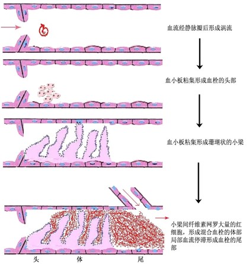

# 局部血液循环障碍

## 充血：

### 动脉性充血：

原因：细小动脉扩张

生理性充血：进食后胃肠道充血；运动时骨骼肌充血；阴茎勃起

病理性充血：炎性充血（炎症早期，致炎因素刺激引起轴突反射和炎症介质释放导致细动脉充血）；减压后充血（受压的局部器官或组织突然解除其所受压力，细动脉发生反射性扩张并充血）

形态变化：组织、器官变大；颜色鲜红；温度升高

**后果：**解除病因→可完全恢复；高血压或动脉硬化等→破裂性出血（如脑出血）；减压后充血→脑相对缺血→虚脱、晕厥

### 静脉性充血（淤血）：

**原因：**

1. 内塞：静脉内血栓或瘤栓的形成
2. 外压：妊娠（子宫压迫髂静脉）；肠粘连、肠扭转时肠系膜静脉受压；肝硬化导致门静脉高压
3. 心力衰竭：左心衰（肺淤血）；右心衰（肝淤血，严重时全身淤血）

变化：大体上组织、器官肿大，颜色暗红（发绀），局部血停滞，毛细血管扩张，散热增加；镜下小静脉和毛细血管扩张，充满红细胞，间质水肿，可伴漏出性出血

**肺淤血：**

病因：左心衰竭→肺静脉回流障碍

形态：大体上肺体积肿胀饱满，暗红色，挤压切面流出淡红色泡沫状液体；镜下肺泡壁毛细血管扩张；肺泡壁变厚、肺泡间隔水肿；肺泡腔内有水肿液、（漏出性）出血；可见心衰细胞（含铁血黄素的巨噬细胞）；纤维化（多见于慢性）

临床：呼吸困难，紫绀，咯血，泡沫痰，水泡音

后果：长期淤血→纤维化，变硬，含铁血黄素沉积→肺褐色硬变

**肝淤血：**

病因：右心衰竭 肝静脉回流受阻

形态：大体上肝体积增大、色暗红（急性），淤血与脂变共存、红黄相间、槟榔肝（慢性）；镜下中央静脉及肝窦扩张淤血、小叶外围脂变（急性），病变较急性肝淤血更明显、可有纤维增生（慢性）

临床：肝大、肝区压疼、肝功能下降

后果：长期慢性肝淤血→淤血性肝硬化，塌陷的网状纤维胶原化，肝窦储脂细胞增生合成胶原，汇管区纤维增生

---

## 血栓形成：

概念：在**活体**的心脏和血管内，血液发生凝固或血液中某些有形成分凝聚形成固体质块的过程叫血栓形成，形成的骨块叫血栓

血栓形成条件：

1. 心血管内皮细胞的损伤：

    心血管内皮损伤→内皮下胶原暴露，血小板凝集，凝血系统激活→触发血栓形成

    

2. 血流状态的改变：

    血流缓慢或有涡流形成，轴流破坏→血小板进入边流，易黏附于内膜；涡流产生的从国际可损伤血管内皮细胞，促使血栓形成

3. 血液凝固性增高

血栓形成过程：

血栓类型：

1. 白色血栓：位于血栓起始部，由血小板梁、纤维素、白细胞组成
2. 混合血栓：见于静脉血栓的体部、动脉瘤、室壁瘤的附壁血栓及左心房的球形血栓，由血小板、白细胞、红细胞、纤维蛋白组成
3. 红色血栓：多见于静脉血栓的尾部，与血管壁无粘连，由纤维素网和红细胞组成
4. 透明血栓：在微血管内，由纤维素构成

血栓结局：

1. 软化、溶解、吸收：纤维蛋白溶酶系统＋白细胞溶蛋白酶→溶解软化；小的被溶解吸收，大的血流冲击形成碎块或整体脱离，形成血栓栓塞
2. 机化、再通：血管壁长入新生的肉芽组织、逐渐取代血栓；机化过程中，血栓干燥收缩、软化，内部或与血管壁间出现裂隙，新生的内皮覆盖其表面，形成新血管
3. 钙化：不完全机化＋钙盐沉积↑→静脉石、动脉石

血栓对机体影响：

- 有利：溃疡病出血时止血
- 不利：
    1. 阻塞血管：动脉内血栓形成→梗死；静脉内血栓形成→淤血
    2. 心瓣膜赘生物(血栓)→瓣膜病
    3. 血栓脱落→栓塞→梗死
    4. 广泛出血→DIC（弥散性血管内凝血）

---

## 栓塞：

血管内出现不溶于血液的异常物质，随血流运行阻塞血管腔的现象称为栓塞。阻塞血管的异常物质称为栓子，最常见者为血栓。

栓子的运行途径：

1. 静脉→右心栓子→肺A及分支
2. 左心栓子→大循环→小动脉及其分支
3. 肠系膜静脉→肝内门静脉
4. 房缺、室缺：静脉、右心→左心、大循环动脉
5. 逆行性栓塞：下腔静脉 →下腔静脉小分支(肝、肾、髂静脉)

栓塞类型：

1. 血栓栓塞：
    - 肺动脉栓塞：中小分支的栓塞→不引起严重后果；有慢性肺淤血→肺出血性梗死；肺动脉大分支及主干→呼吸循环衰竭→猝死；多数小栓子栓塞→右心衰→猝死
    - 体循环动脉栓塞：栓子多数来自左心（赘生物、附壁血栓），少数来自动脉（附壁血栓）；导致下肢、脑、肠、肾、脾梗死
2. 气体栓塞：
    - 空气栓塞：分娩、头颈手术、胸肺创伤→空气入血→多发性栓塞/猝死
    - 减压病：沉箱作业、潜水→氮气游离→气泡→局部缺血梗死
3. 羊水栓塞：剧烈宫缩→羊水(角化上皮、胎毛、胎粪、粘液)入血→栓塞
4. 脂肪栓塞：多来源于长骨骨折、脂肪组织严重挫伤和烧伤。脂滴少量时可被吞噬细胞吸收；进入肺血管，使血管壁通透性增高，引起肺水肿、肺出血，较多时影响气体交换，导致窒息或急性右心衰竭
5. 其他栓塞：癌细胞栓塞，寄生虫、细菌栓塞

---

## 梗死：

器官或局部组织由于血管阻塞、血流停止而引起的坏死称为梗死。

梗死的原因：

1. 内塞: A内血栓形成

2. 外压：过紧绷带

3. 痉挛: A持续性痉挛（如冠心病）

4. 血管受压闭塞：肠叠套或扭转、嵌顿疝、卵巢囊肿及睾丸扭转

梗死的条件：

1. 动脉血供应阻断

2. 供血血管的类型：
    - 双重血液循环供血不易发生梗死
    - 单一血管供血相对易发生梗死
3. 局部组织对缺血的敏感程度

梗死类型：

1. 贫血性梗死：发生于组织致密、侧枝循环不丰富的实质器官，如脾、肾、心、脑
2. 出血性梗死：条件：**高度淤血**，组织结构疏松
3. 败血性梗死：脓毒败血症时,含有细菌团的栓子栓塞在多个器官形成脓肿

梗死对机体的影响：

1. 肾梗死→腰痛、血尿
2. 肺梗死→胸膜刺激征、咯血
3. 肠梗死→肠绞窄（急腹症）→肠穿孔、腹膜炎
4. 心肌梗死→心衰、猝死
5. 脑梗死→相应功能障碍、死亡
6. 四肢梗死→坏疽

梗死结局：

- 坏死组织、血被吸收→疤痕
- 包裹
- 导致死亡